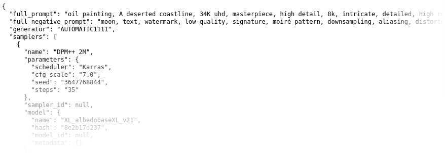

# SD-Parsers

Try it out yourself: https://sd-parsers.vercel.app/

Read structured metadata from images created with stable diffusion.

A TypeScript/Node.js library for extracting prompt information and generation parameters from AI-generated images.

> **Note**: This is a TypeScript port of the original Python sd-parsers library, providing the same functionality with async/await support and TypeScript type safety.



## Features

Prompts as well as some well-known generation parameters are provided as easily accessible properties.

Supports reading metadata from images generated with:
* Automatic1111's Stable Diffusion web UI ✅
* Fooocus ✅
* ComfyUI ✅
* InvokeAI ✅
* NovelAI ✅

## Installation

```bash
npm install sd-parsers
```

## Command Line Usage

You can use sd-parsers from the command line to quickly extract metadata from images:

```bash
npx sd-parsers image1.png image2.jpg
```

This will output the extracted metadata in JSON format for each image.

## Usage

### Basic usage:

For a simple query, import `ParserManager` from `sd-parsers` and use its `parse()` method to parse an image.

#### Read prompt information from a given filename with `parse()`:

```typescript
import { ParserManager } from 'sd-parsers';

const parserManager = new ParserManager();

async function main() {
  const promptInfo = await parserManager.parse('image.png');

  if (promptInfo) {
    for (const prompt of promptInfo.prompts) {
      console.log(`Prompt: ${prompt.value}`);
    }
  }
}
```

#### Read prompt information from a Buffer:

```typescript
import { ParserManager } from 'sd-parsers';
import { readFile } from 'fs/promises';

const parserManager = new ParserManager();

async function main() {
  const imageBuffer = await readFile('image.png');
  const promptInfo = await parserManager.parse(imageBuffer);
  
  if (promptInfo) {
    console.log(promptInfo);
  }
}
```

### Parsing options:

#### Configure metadata extraction:

```typescript
import { ParserManager, Eagerness } from 'sd-parsers';

const parserManager = new ParserManager({ eagerness: Eagerness.EAGER });
```

`Eagerness` sets the metadata searching effort:

- **FAST**: cut some corners to save some time
- **DEFAULT**: try to ensure all metadata is read (default)
- **EAGER**: include additional methods to try and retrieve metadata (computationally expensive!)

#### Only use specific parser modules:

```typescript
import { ParserManager, AUTOMATIC1111Parser } from 'sd-parsers';

const parserManager = new ParserManager({
  managedParsers: [AUTOMATIC1111Parser]
});
```

#### Debug mode:

```typescript
import { ParserManager } from 'sd-parsers';

const parserManager = new ParserManager({ debug: true });
```

### Output

The parser returns a `PromptInfo` object with the following structure:

```typescript
interface PromptInfo {
  generator: Generators;
  samplers: Sampler[];
  metadata: Record<string, any>;
  rawParameters: Record<string, any>;
}
```

Access parsed data using helper functions:

```typescript
import { getFullPrompt, getFullNegativePrompt, getModels } from 'sd-parsers';

const prompt = getFullPrompt(promptInfo);
const negativePrompt = getFullNegativePrompt(promptInfo);
const models = getModels(promptInfo);
```

## API Reference

### Classes

- `ParserManager`: Main class for parsing images
- `AUTOMATIC1111Parser`: Parser for AUTOMATIC1111 webui images ✅
- `FooocusParser`: Parser for Fooocus images ✅
- `ComfyUIParser`: Parser for ComfyUI images ✅
- `InvokeAIParser`: Parser for InvokeAI images ✅
- `NovelAIParser`: Parser for NovelAI images ✅

### Types

- `PromptInfo`: Contains structured image generation parameters
- `Sampler`: Represents a sampler used during image generation
- `Model`: Represents a checkpoint model
- `Prompt`: Represents an image generation prompt

### Enums

- `Generators`: Supported image generators
- `Eagerness`: Metadata extraction effort levels

## Development

### Building

```bash
npm run build
```

### Testing

```bash
npm test
```

### Watch mode

```bash
npm run dev
```

## Differences from Python Version

This TypeScript port has some differences from the original Python version:

1. **Image Processing**: Uses Sharp instead of PIL for image processing
2. **Async/Await**: All parsing operations are asynchronous
3. **Type Safety**: Full TypeScript type definitions
4. **Limited Extractors**: Some advanced metadata extraction features are not yet implemented (PNG text chunks, advanced EXIF)
5. **Module System**: Uses ES modules/CommonJS instead of Python imports

## Contributing

Contributions are welcome! This is a port of the Python sd-parsers library. If you find issues or want to add support for additional image generators, please open an issue or pull request.

## License

MIT License - same as the original Python version.

## Credits

- Original Python library: [sd-parsers](https://github.com/d3x-at/sd-parsers)
- Image processing: [Sharp](https://sharp.pixelplumbing.com/)
